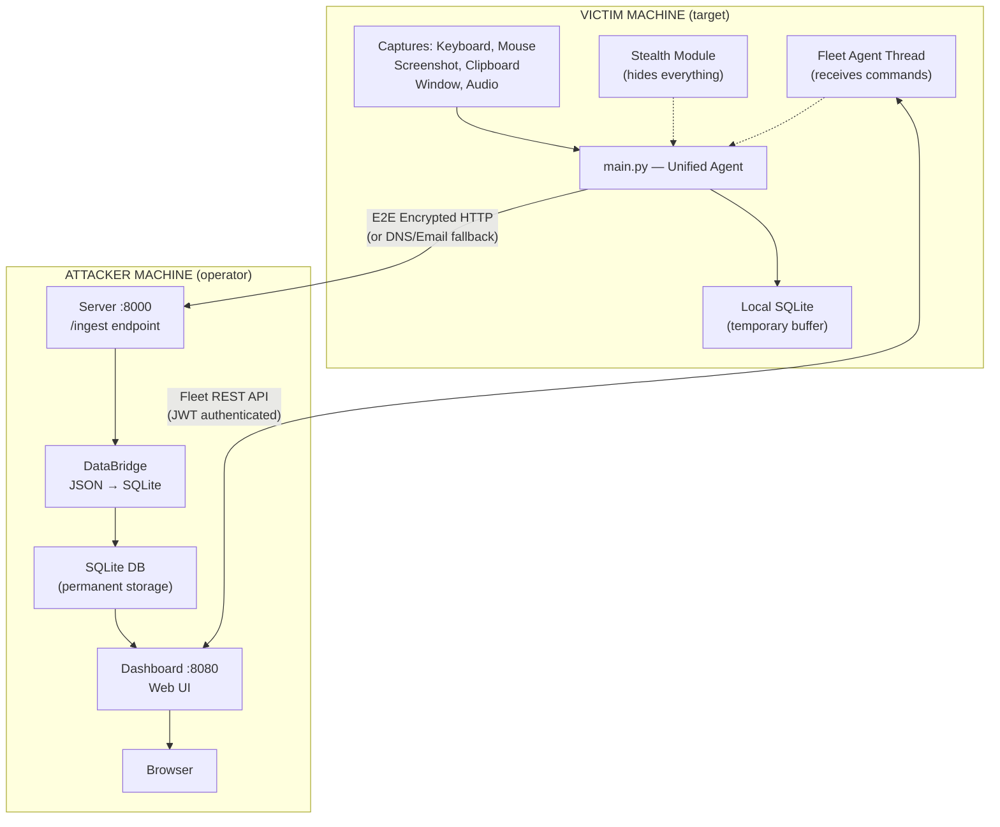
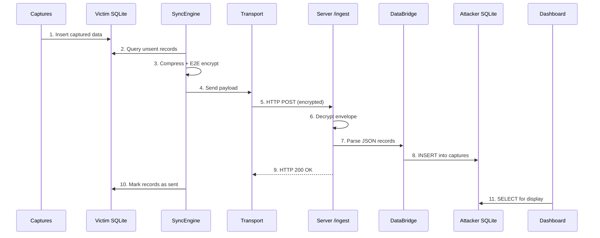
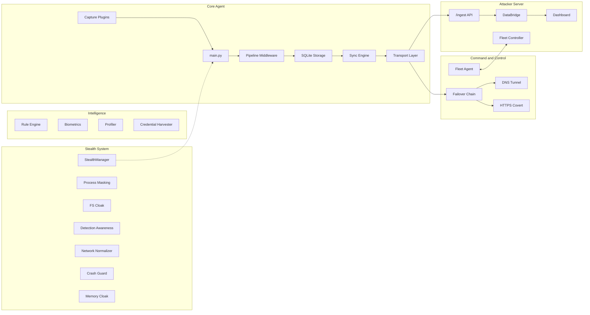
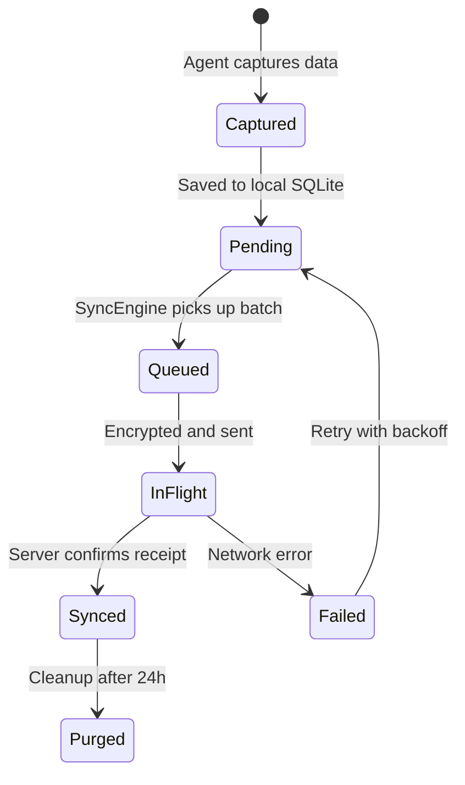

# Architecture

## Deployment Model

The system is deployed across **two machines** -- the victim (target) and the attacker (operator). They communicate over the internet via encrypted HTTP, with no direct database connection.



**Key points:**
- The victim machine only makes **outbound** connections (no listening ports)
- Data is **E2E encrypted** (Curve25519 + AES-256-GCM) before leaving the victim
- The local SQLite on the victim is a **temporary buffer** -- data is deleted after successful sync
- The attacker's SQLite is the **permanent record** that the dashboard reads from
- The two databases are never directly connected -- only linked by encrypted HTTP packets

## What Runs Where

| Machine | Process | Command | Port | Role |
|---------|---------|---------|------|------|
| **Victim** | `main.py` | `python main.py` | None (outbound only) | Capture data + fleet agent (unified) |
| **Attacker** | `server/run.py` | `python -m server.run` | 8000 | E2E ingest server (receives encrypted payloads) |
| **Attacker** | `dashboard/run.py` | `python -m dashboard.run --enable-fleet` | 8080 | Web dashboard + fleet controller |

## Data Flow (Agent to Dashboard)



### Step-by-step:

1. **Capture** -- Agent captures keystrokes, screenshots, etc. and writes to local SQLite
2. **Queue** -- SyncEngine queries for unsent records every 10-30 seconds
3. **Encrypt** -- Records are bundled into JSON, compressed with zlib, encrypted with E2E (Curve25519 + AES-256-GCM)
4. **Transport** -- Encrypted payload sent via configured transport (HTTP primary, DNS/Email fallback)
5. **Receive** -- Server's `/ingest` endpoint receives the encrypted envelope
6. **Decrypt** -- Server decrypts using its private key, verifies signature and replay protection
7. **Parse** -- DataBridge parses the JSON payload into individual records
8. **Store** -- Records inserted into the attacker's SQLite database
9. **Confirm** -- Server responds with 200 OK
10. **Cleanup** -- Agent marks records as "sent", purges after 24h
11. **Display** -- Dashboard reads from the attacker's SQLite and shows in browser

## Component Overview



## Offline-First Sync

The system uses an **offline-first** design. Data is always captured and stored locally first, then synced when the network is available.



If the network is down, data accumulates locally (up to 100MB). When connectivity returns, the SyncEngine drains the backlog automatically with adaptive batch sizing and exponential backoff.

## Plugin Architecture

Capture and transport modules self-register via decorators:

```python
@register_capture("keyboard")
class KeyboardCapture(BaseCapture):
    ...

@register_transport("http")
class HttpTransport(BaseTransport):
    ...
```

Modules are auto-imported at startup. Missing optional dependencies are handled gracefully -- the module is simply skipped.

## Event System

The [`EventBus`](../engine/event_bus.py) provides decoupled pub/sub event routing. Components subscribe to event types and receive notifications without direct coupling:

- Rule engine subscribes to `*` (all events)
- Biometrics subscribes to `keystroke` events
- Profiler subscribes to `window` and `app_focus` events
