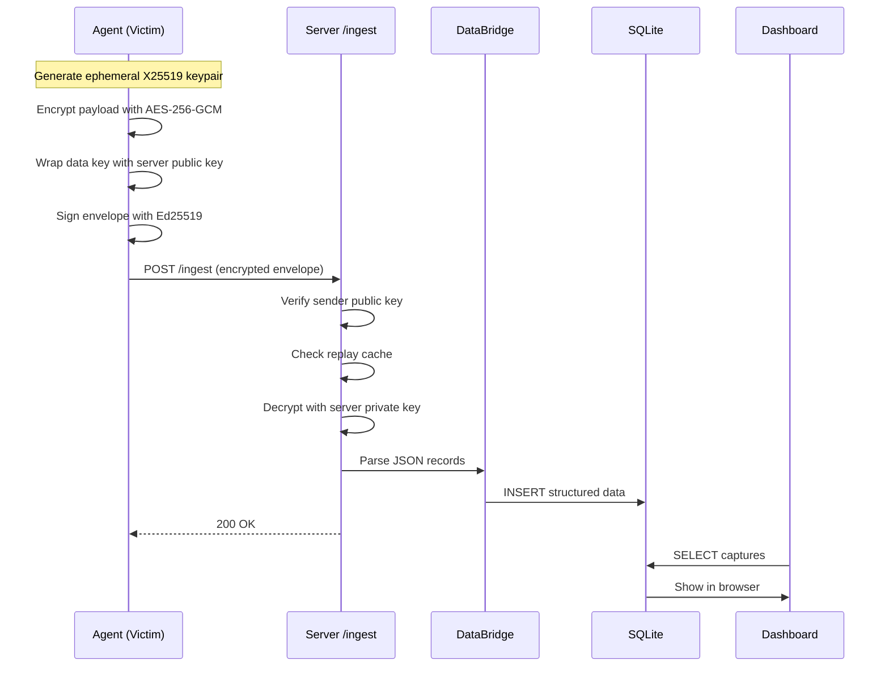

# Encryption and E2E Transport

## E2E Encryption Flow



## Encryption Modes

### E2E (Recommended)
- **Crypto flow:** X25519 key agreement -> HKDF -> AES-256-GCM
- Each payload gets an **ephemeral keypair** (forward secrecy)
- Envelope includes Ed25519 signature for integrity
- Server can only decrypt with its private key
- **Source:** [`crypto/envelope.py`](../crypto/envelope.py), [`crypto/protocol.py`](../crypto/protocol.py)

### Symmetric
- AES-256-CBC with random IV per encryption
- PBKDF2-HMAC-SHA256 key derivation (480,000 iterations)
- Simpler but no forward secrecy
- **Source:** [`utils/crypto.py`](../utils/crypto.py)

## Setup

### 1. Generate server keys

```bash
python -m server.run --generate-keys --config config/server_config.example.yaml
```

This prints the base64 **server public key**.

### 2. Configure the agent

```yaml
encryption:
  enabled: true
  mode: "e2e"
  e2e:
    server_public_key: "<paste key here>"
    key_store_path: "~/.local/share/security-keys/"
    pin_server_key: true
```

### 3. Run the server

```bash
python -m server.run --config config/server_config.example.yaml --host 0.0.0.0 --port 8000
```

## Server Endpoints

| Endpoint | Description |
|----------|-------------|
| `GET /health` | Health check |
| `POST /ingest` | Receive encrypted envelopes |
| `POST /register` | Client key registration |

## Server Auth and Security

```yaml
e2e_server:
  auth_tokens: ["your-secret-token"]
  registration_tokens: ["register-token"]
  allowed_client_keys: []
  clients_file: "./server_data/clients.json"
  replay_ttl_seconds: 3600
```

- **Replay protection:** Persisted to SQLite (survives server restarts)
- **Sequence tracking:** Detects out-of-order and replayed envelopes
- **Sender allowlist:** Only registered client keys accepted
- **TLS:** Set `ssl_certfile` and `ssl_keyfile` for HTTPS

## Compression

- ZIP bundling (multiple files into one archive)
- GZIP compression with ratio logging
- **Source:** [`utils/compression.py`](../utils/compression.py)
