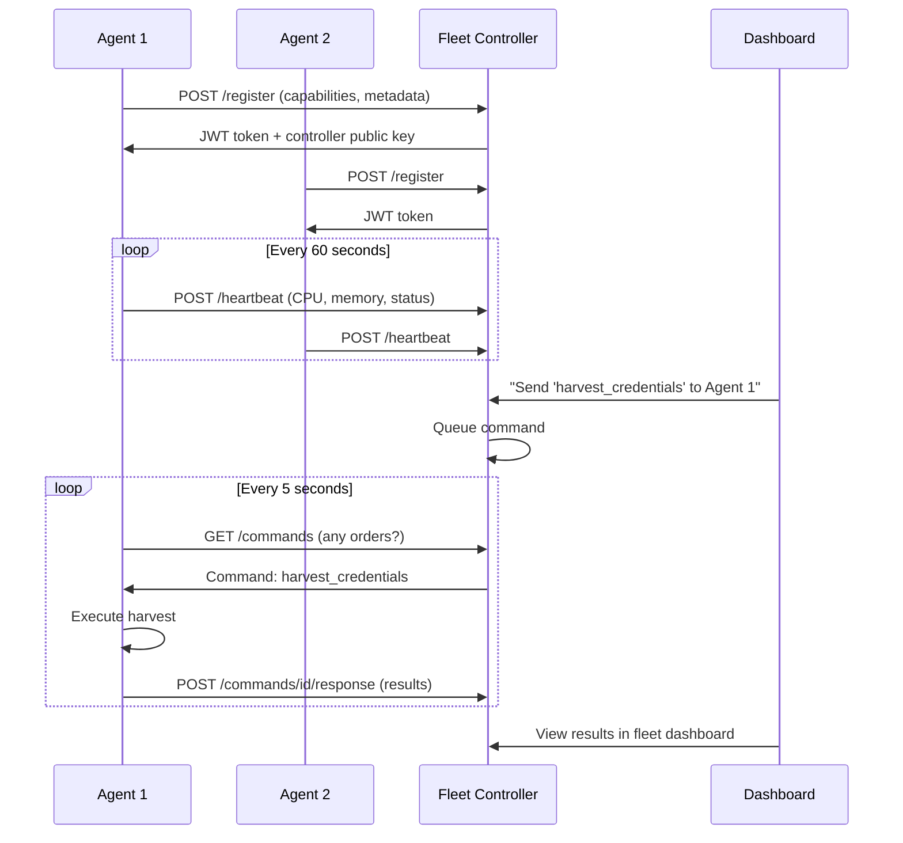

# Fleet Management

Distributed agent management system for controlling multiple monitoring instances from a central dashboard.

## Architecture



## Components

### Fleet Controller (runs inside Dashboard)
- **Source:** [`fleet/controller.py`](../fleet/controller.py)
- Manages agent registration, heartbeats, status tracking
- Queues and distributes commands to agents
- Persists everything to SQLite via [`storage/fleet_storage.py`](../storage/fleet_storage.py)
- Initializes inside `dashboard/app.py` when `--enable-fleet` is set

### Fleet Agent (runs on victim, integrated into main.py)
- **Source:** [`fleet/agent.py`](../fleet/agent.py)
- Registers with controller, receives JWT tokens
- Polls for commands every 5 seconds
- Sends heartbeats with system metrics every 60 seconds
- Executes commands locally and reports results
- Integrated into `main.py` as a background thread (unified agent)

### Fleet Authentication
- **Source:** [`fleet/auth.py`](../fleet/auth.py)
- JWT-based per-agent authentication
- Access tokens (15 min) + refresh tokens (7 days)
- Per-agent isolation (token compromise doesn't affect others)

### API Endpoints

**Agent-facing:**
| Endpoint | Method | Description |
|----------|--------|-------------|
| `/api/v1/fleet/register` | POST | Agent registration |
| `/api/v1/fleet/heartbeat` | POST | Accept heartbeats |
| `/api/v1/fleet/commands` | GET | Poll for pending commands |
| `/api/v1/fleet/commands/{id}/response` | POST | Command results |

**Dashboard-facing:**
| Endpoint | Method | Description |
|----------|--------|-------------|
| `/api/dashboard/fleet/agents` | GET | List all agents |
| `/api/dashboard/fleet/agents/{id}` | GET | Agent details |
| `/api/dashboard/fleet/agents/{id}/command` | POST | Send command |
| `/api/dashboard/fleet/agents/{id}/commands` | GET | Command history |

## Configuration

```yaml
fleet:
  enabled: false
  database_path: "./data/fleet.db"
  agent:
    controller_url: "http://your-server:8080/api/v1/fleet"
    heartbeat_interval: 60
    command_poll_interval: 5
    sign_requests: false
  auth:
    jwt_secret: "CHANGE_ME_IN_PRODUCTION"
    access_token_ttl_minutes: 15
  security:
    require_signature_verification: false
```

## Running

**Start the dashboard with fleet enabled (attacker machine):**
```bash
python -m dashboard.run --enable-fleet --admin-pass your_password
```

**The agent auto-starts fleet integration when `fleet.enabled: true` and `fleet.agent.controller_url` is set in config.**
