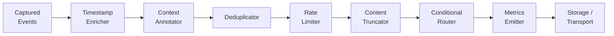

# Pipeline and Middleware

A configurable middleware chain that processes captured events before storage/transport.

- **Source:** [`pipeline/`](../pipeline/)

## How It Works



Events pass through each middleware in order. Each middleware can:
- **Pass** the event through unchanged
- **Modify** the event (add fields, truncate data)
- **Drop** the event (dedup, rate limit)
- **Route** the event to a different backend

## Built-in Middleware

| Middleware | Purpose |
|-----------|---------|
| `timestamp_enricher` | Adds/normalizes timestamps |
| `context_annotator` | Adds system context (hostname, username, OS) |
| `deduplicator` | Suppresses duplicate events within a time window |
| `content_truncator` | Truncates large payloads to configurable max length |
| `rate_limiter` | Caps events per second |
| `conditional_router` | Routes events to different backends by type |
| `metrics_emitter` | Logs pipeline throughput metrics |
| `anonymizer` | PII detection and redaction (emails, credit cards, SSN, etc.) |

## Configuration

```yaml
pipeline:
  enabled: true
  middleware:
    - name: timestamp_enricher
      enabled: true
    - name: deduplicator
      enabled: true
      config:
        window_seconds: 5
        types: ["clipboard", "window"]
    - name: rate_limiter
      enabled: true
      config:
        max_events_per_second: 50
    - name: anonymizer
      enabled: true
      config:
        strategy: "mask"
        patterns: ["email", "credit_card", "ssn"]
```

## Source Files

- [`pipeline/core.py`](../pipeline/core.py) -- Pipeline orchestrator
- [`pipeline/base_middleware.py`](../pipeline/base_middleware.py) -- Middleware base class
- [`pipeline/registry.py`](../pipeline/registry.py) -- Built-in middleware registry
- [`pipeline/context.py`](../pipeline/context.py) -- Pipeline context
- [`pipeline/middleware/anonymizer.py`](../pipeline/middleware/anonymizer.py) -- PII redaction
