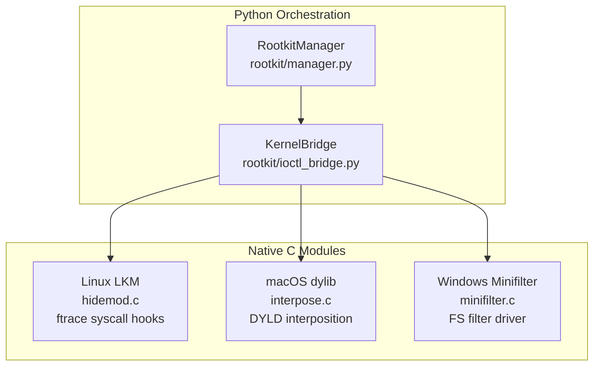

# Rootkit Integration

Kernel-level hiding via native C modules with a Python orchestration layer. Hides the agent's process, files, and network connections from OS-level tools (ps, ls, netstat, Activity Monitor, Task Manager).

- **Source:** [`rootkit/`](../rootkit/) package

## Architecture



## Platform Implementations

### Linux LKM (`rootkit/native/linux/hidemod.c`)
- Loadable Kernel Module using **ftrace-based syscall hooking** (Linux 5.7+)
- Hooks `getdents64` to hide PIDs from `/proc` and files from directory listings
- Hooks `tcp4_seq_show` to hide network connections from `netstat`/`ss`
- Module self-hides from `lsmod` and `/sys/module`
- Control via `/dev/.null` ioctl interface with `HIDE_PID`, `HIDE_PREFIX`, `HIDE_PORT` commands
- Lock-free readers using `READ_ONCE`/`WRITE_ONCE` for syscall-hot paths

**Build:** `make -C /lib/modules/$(uname -r)/build M=$(pwd) modules`

### macOS Interposer (`rootkit/native/macos/interpose.c`)
- DYLD interposition library using `__DATA,__interpose` section
- Hooks `readdir` and `readdir_r` to filter directory entries
- Exported control functions callable from Python via `ctypes.CDLL`
- Requires SIP disabled for DYLD injection

**Build:** `clang -dynamiclib -o interpose.dylib interpose.c`

### Windows Minifilter (`rootkit/native/windows/minifilter.c`)
- Filesystem minifilter driver for IRP_MJ_DIRECTORY_CONTROL
- Filters `FileBothDirectoryInformation` to hide files
- Communication via `FilterCommunicationPort`
- Requires WDK to build, driver signing for production

## Python Manager (`rootkit/manager.py`)

```python
from rootkit.manager import RootkitManager

mgr = RootkitManager({"enabled": True, "auto_compile": True})
mgr.install()      # compile + load native module
mgr.hide_self()    # hide PID, files, ports
mgr.uninstall()    # unload + cleanup
```

Gracefully degrades: if root is unavailable or compilation fails, continues without kernel hiding.

## Configuration

```yaml
rootkit:
  enabled: false
  auto_compile: true
  hide_prefixes:
    - ".com.apple.dt.instruments"
    - "preferences.db"
  hide_ports: []
```

## Requirements

| Platform | Requirement |
|----------|-------------|
| Linux | `linux-headers-$(uname -r)`, `gcc`, `make`, root access |
| macOS | Xcode CLT, SIP disabled |
| Windows | Visual Studio 2022 + WDK, test-signing enabled |
