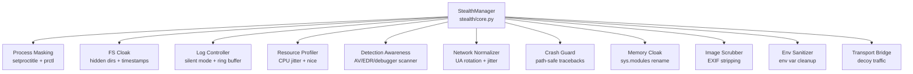

# Stealth Mode

Comprehensive stealth system with 11 subsystems that minimize the application's observable footprint across process identity, file system, logging, resource usage, network traffic, and active detection avoidance.

- **Source:** [`stealth/`](../stealth/) package, orchestrated by [`stealth/core.py`](../stealth/core.py)

## Architecture



## Stealth Levels

| Level | What's Enabled |
|-------|---------------|
| `off` | No stealth measures (default) |
| `low` | Process rename + log suppression + hidden files + crash guard |
| `medium` | + resource profiling + detection awareness + env sanitizer |
| `high` | + network normalization + transport bridge + image scrubbing + memory cloak |
| `maximum` | + everything enabled, memory-only logging, minimal disk, auto-hibernate, decoy traffic, rootkit (if available) |

## Subsystems

### Process Masking (`stealth/process_masking.py`)
- Multi-layer process name replacement (setproctitle + ctypes prctl PR_SET_NAME on Linux)
- `sys.argv[0]` overwrite for `/proc/self/cmdline` sanitization
- Thread name sanitization (e.g., `cgeventtap-keyboard` -> `WorkerThread-0`)
- Platform-specific legitimate process name database (10+ names per OS)
- Optional name rotation on configurable timer
- macOS Activity Monitor workaround via Python binary cloning

### File System Cloak (`stealth/fs_cloak.py`)
- Platform-aware path aliasing (data, PID, logs, keys -> innocuous system paths)
- Hidden directory/file creation: macOS `UF_HIDDEN`, Windows `FILE_ATTRIBUTE_HIDDEN`, Linux dot-prefix
- Timestamp preservation context manager (restores mtime/atime after writes)
- Innocuous service labels and descriptions per platform

### Log Controller (`stealth/log_controller.py`)
- Silent mode (complete console output suppression)
- File log suppression
- Memory ring-buffer handler (configurable size, queryable for remote debug)
- Log sanitization filter (regex scrub of identifiable strings)
- Startup banner suppression

### Resource Profiler (`stealth/resource_profiler.py`)
- CPU priority reduction: `os.nice(19)` on Unix, `IDLE_PRIORITY_CLASS` on Windows
- Gaussian jitter on capture intervals (natural-looking timing)
- CPU ceiling enforcement via psutil self-monitoring
- I/O spread delays for database writes
- Idle mimicry (configurable long-sleep when no user activity)

### Detection Awareness (`stealth/detection_awareness.py`)
- Background scanner thread with randomized 10-60s intervals
- Process scanner for 50+ monitoring tools per platform (Activity Monitor, Wireshark, strace, etc.)
- EDR/AV detection: 100+ security product process names (CrowdStrike, SentinelOne, Defender, etc.)
- Multi-layer debugger detection: `sys.gettrace`, TracerPid, ptrace, IsDebuggerPresent
- Cross-platform VM/sandbox detection: MAC prefixes, DMI, WMI, hardware heuristics
- 3 threat levels (LOW/MEDIUM/HIGH) with 5 response actions (ignore -> self_destruct)

### Network Normalizer (`stealth/network_normalizer.py`)
- Gaussian timing jitter on send intervals
- Packet-size normalization (random-byte padding)
- User-Agent rotation via fake-useragent library (20 built-in fallback UAs)
- Send-window scheduling (only transmit during configurable "active hours")
- Token-bucket bandwidth throttling
- Local DNS cache to minimize query patterns

### Crash Guard (`stealth/crash_guard.py`)
- Custom `sys.excepthook` that strips identifiable file paths from tracebacks
- Suppresses stderr output in stealth mode
- Logs to memory ring buffer only

### Memory Cloak (`stealth/memory_cloak.py`)
- Renames project modules in `sys.modules` (e.g., `capture` -> `services.io`)
- Scrubs `__file__` and `__doc__` attributes on all project modules
- Secure `bytearray` wiping for sensitive data

### Image Scrubber (`stealth/image_scrubber.py`)
- Strips all EXIF/PIL metadata from screenshots
- Hash-based filenames (no `screenshot_0001.png` patterns)

### Environment Sanitizer (`stealth/env_sanitizer.py`)
- Renames `KEYLOGGER_*` env vars to `SVC_*`
- Scrubs `/proc/self/environ` on Linux
- Full `sys.argv` sanitization

### Transport Bridge (`stealth/transport_bridge.py`)
- Wires NetworkNormalizer into actual HTTP transport
- Decoy traffic generator (HTTPS GETs to popular sites)
- Referrer header rotation
- Connectivity probe obfuscation (HTTPS GET instead of bare TCP)

## Configuration

```yaml
stealth:
  enabled: true
  level: "high"

  process:
    masquerade_name: "auto"
    rotate_interval: 0
    sanitize_threads: true

  detection:
    enabled: true
    monitor_response: "throttle"
    debugger_response: "pause"
    security_tool_response: "pause"
    vm_detection: true

  network:
    timing_jitter: 0.4
    user_agent_rotation: true
    send_window:
      enabled: false
      start_hour: 9
      end_hour: 18
```
