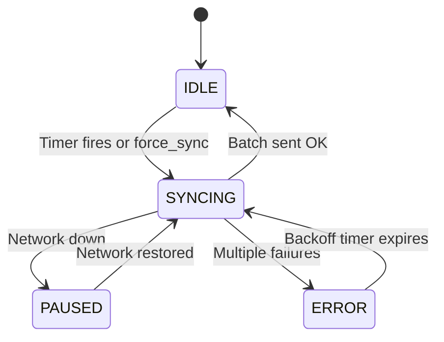

# Offline-First Sync Engine

Comprehensive sync pipeline replacing the basic get_pending/send/mark_sent loop with priority queuing, adaptive batching, checkpointing, connectivity awareness, and conflict resolution.

- **Source:** [`sync/`](../sync/) package

## How It Works



## Components

### Sync Ledger (`sync/ledger.py`)
- Per-record state machine: PENDING -> QUEUED -> IN_FLIGHT -> SYNCED | FAILED | DEAD
- Retry tracking with exponential backoff
- Content-hash fingerprinting (SHA-256) for deduplication
- Priority tiers: CRITICAL (commands) > NORMAL (keystrokes) > LOW (screenshots)

### Connectivity Monitor (`sync/connectivity.py`)
- Background daemon probing network availability
- Network type detection: WiFi / cellular / wired / VPN / offline
- Per-network-type sync policies (batch limits, intervals)
- Backpressure signal when local DB exceeds threshold

### Checkpoint Manager (`sync/checkpoint.py`)
- Per-batch checkpoints written before send
- Crash recovery: re-queues incomplete records on startup
- Partial acknowledgment support

### Conflict Resolver (`sync/conflict_resolver.py`)
- 4 built-in strategies: LastWriterWins, ServerWins, ClientWins, MergeFields
- Content-hash deduplication
- Conflict journal for auditing

### Sync Engine (`sync/engine.py`)
- Adaptive batch sizing: grows on success (+25%), shrinks on failure (halve)
- zlib compression with skip threshold
- SHA-256 integrity digest per batch
- Exponential backoff: 2s -> 4s -> ... -> 5min cap
- Scheduling modes: immediate, interval, manual

## Configuration

```yaml
sync:
  enabled: true
  mode: "immediate"
  max_batch_size: 50
  compression: true
  max_retry_attempts: 5
  retry_backoff_base: 2.0
  connectivity:
    check_interval: 30
    backpressure_threshold_mb: 100
    policies:
      wifi: { max_batch_mb: 10, min_interval: 0 }
      cellular: { max_batch_mb: 1, min_interval: 300 }
```
